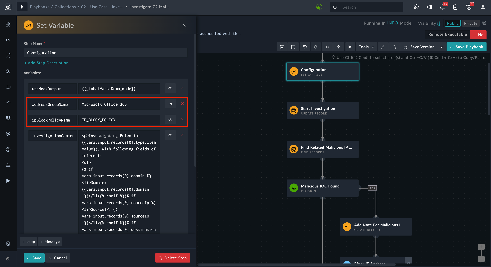

| [Home](../README.md) | 
|----------------------| 

# Usage 
 
Refer to [Simulate Scenario documentation](https://github.com/fortinet-fortisoar/solution-pack-soc-simulator/blob/develop/docs/usage.md) to understand how to simulate and reset scenarios. 
 
To understand the process FortiSOAR follows to respond to phishing emails, we have included a scenario &mdash; **Malicious Outbound Connection** with this solution pack. Refer to the section Malicious C2 Outbound Traffic to understand how this solution pack automation addresses your needs. 
 
## Malicious Outbound Connection

This scenario generates an example alert of type *Beaconing* from the **Fortinet FortiSIEM** connector.

Navigate to the demo alert and note the following:

- The demo alert created is an example of a default data ingestion using the **Data Ingestion** feature
- The alert is of the type *Beaconing*
- The reported alert contains the following among other related sources data:
    - Source IP address
    - Destination IP address
    - Source port
    - Destination port

Users can launch **Investigate C2 Malware Traffic** playbook to take action on the demo alert created.

These playbooks perform the following automated tasks:
- IP addresses associated with alert is investigated and, when found malicious, blocked on the firewall
- Affected host is isolated for further investigation and scanning
- Searching for known IOCs for C2 Malicious Traffic based on IP Addresses found

> **Note:** Please replace the names of the 'IP Block Policy' and 'Address Group' with the names configured on your FortiGate firewall in the 'Configuration' step of the "Investigate C2 Malware Traffic" playbook.

